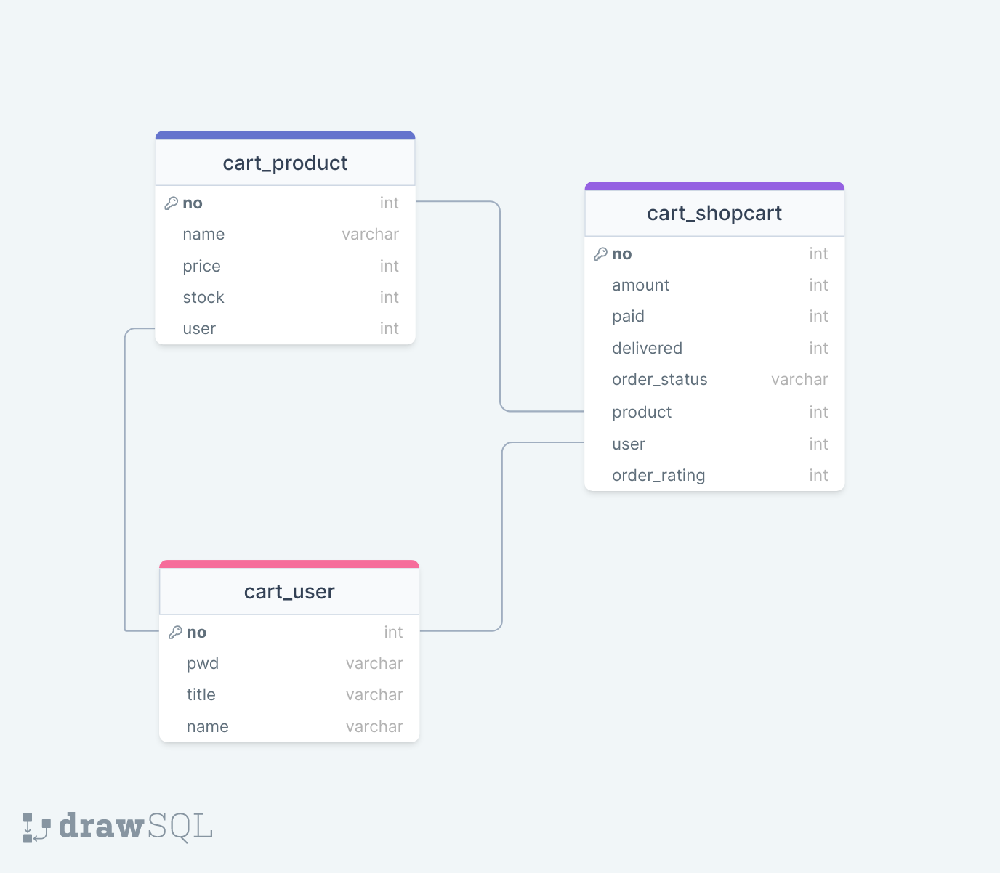

# online_shopping

## Table of Contents
1. [介紹](#介紹)
2. [客戶功能](#客戶功能)
   - [瀏覽商品](#瀏覽商品)
   - [購物車](#購物車)
3. [商家功能](#商家功能)
    - [新增或刪除商品](#新增或刪除商品)
    - [編輯商品內容](#編輯商品內容)
4. [流程圖](#流程圖)
5. [Schema](#schema)

## 介紹
系統使用Django架構，功能依據角色有所不同：客戶和商家。
使用者可自行註冊帳號並選擇身分別後，進行商家或客戶的角色行為。

客戶擁有以下三種功能：瀏覽商品（商品名稱、價錢、商品敘述）、將商品加入或移出購物車以及查看購物車內容(商品項目、單價、數量、總價)。

商家負責管理商品的相關事務，例如新增或刪除商品、編輯商品內容（如:名稱、價格、描述等）。

物流需與商家搭配，處理訂單寄送之事務。

## 客戶功能
### 瀏覽商品
客戶可以透過我們的網站，利用其簡單直觀的介面來瀏覽商品。我們的設計使商品清單得以清晰、易讀的方式呈現，且每件商品都附有詳盡的文字說明，包括特色、用途和規格，使客戶能夠全面了解商品資訊。

### 購物車
在瀏覽商品時，客戶可以輕鬆地將心儀的商品加入購物車，以及在不再需要商品的時候將其移出購物車。這一項功能的實現，為客戶提供了方便快捷的購物體驗，確保購物清單完全符合客戶需求。

除此之外，客戶也可以隨時查看購物車內容，我們的系統會詳細列出購物車中的每個商品項目，包括單價、數量和總價。使客戶能夠以直觀且清晰的方式了解他們的購物清單，並在需要時進行數量調整或移除商品。

新增可自行選擇送出哪一筆訂單之功能。

## 商家功能
### 新增或刪除商品
商家可以輕鬆地在我們的系統中新增或刪除商品，以確保商品清單的即時更新。

### 編輯商品內容
商家也可以在任何時候編輯商品內容，包括價格、描述、規格等，以確保商品信息的準確性。

## 物流功能
將訂單從商家運送到客戶。在系統中，配送員可以查看他們需要運送的訂單列表，並在完成運送後更新訂單的狀態。

## 流程圖

## Schema

